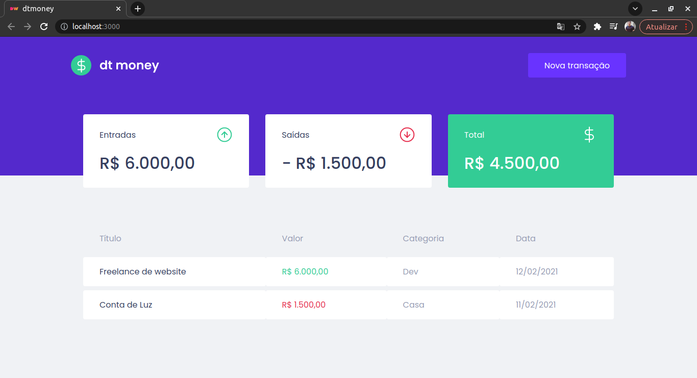
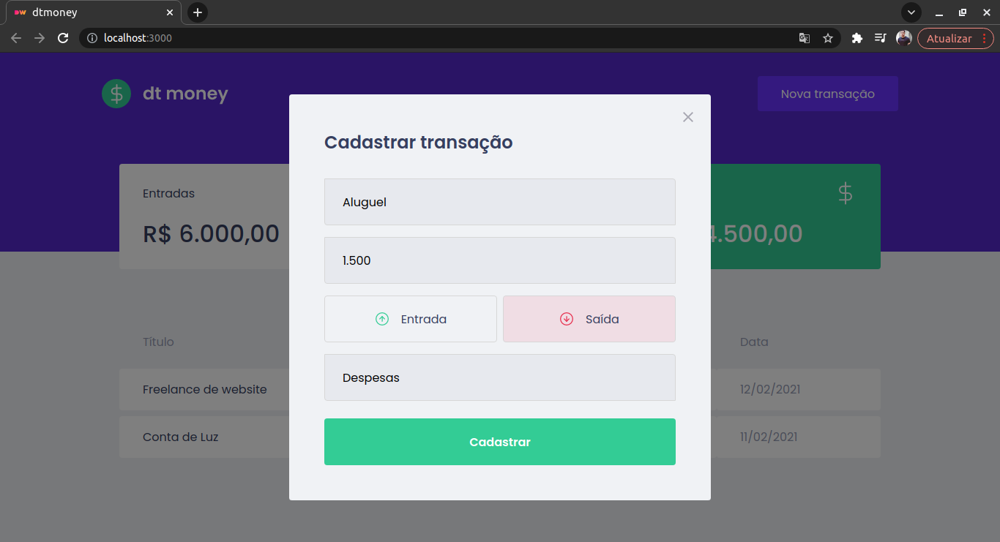

<h1 align = "center" fontSize="60px">
  Dt Money
</h1>

  

  

## :rocket: Tecnologias

 
  
 
 

 <h4 align = "center" style="margin-top: 10px">
  Projeto desenvolvido durante o Ignite da Rocketseat.
</h4>
